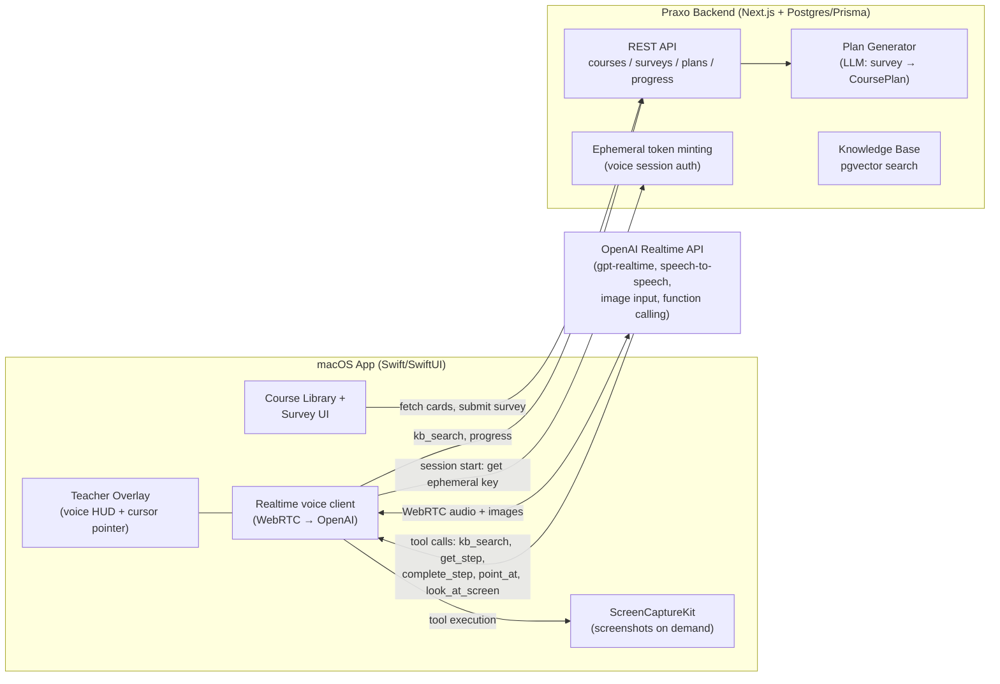

# Praxo — Build Plan

**Praxo is a macOS app that teaches by doing.** The user picks a course (a card), answers a short survey, and Praxo generates a personalized step-by-step plan. Then a voice agent — screen-aware, able to point at things on their screen — coaches them through each step until they produce a real outcome.

**The success scenario this plan is built around:**

> Someone decides to learn how to run ads. Praxo surveys them (goal, budget, product, experience), launches a personalized course plan, and the voice teacher walks them through it step by step — inside the real ad platform, not a sandbox — until their first successful ad campaign is live.

The course isn't "finished" when the videos end. It's finished when the campaign exists.

---

## 1. Product shape

### Three screens, one loop

1. **Course Library** — a grid of cards, one per course ("Run Your First Ad Campaign", "Ship a Landing Page", …). Each card is backed by a knowledge base we author.
2. **Survey → Plan** — picking a card opens a short survey (5–8 questions). Submitting it calls the backend, which generates a **personalized CoursePlan**: ordered steps, each with a goal, instructions, and a **verification gate**.
3. **Teacher Session** — the agent launches as a floating overlay (clicky-style). It sees the user's screen, talks with them over voice, points at UI elements, answers questions from the course knowledge base, and marks steps complete only when the gate is passed.

### The gate principle

Borrowed from the Gatekeeper philosophy in this repo: **steps are verified, not self-reported.** For the ads course, "Step 7: Launch the campaign" is complete when the agent sees the "campaign active" state on screen (or the user confirms with evidence), not when the user clicks "next". This is what makes "finish the course with a successful ads campaign" a checkable claim.

---

## 2. System architecture



### Component responsibilities

| Component | Owns | Built from |
|---|---|---|
| **macOS app** | Course cards, survey UI, overlay HUD, cursor pointing, screen capture, voice transport | New SwiftUI app; overlay + pointing + ScreenCaptureKit patterns ported from clicky/openclicky (MIT) |
| **Backend** | Course content + KB, survey definitions, plan generation, progress, users/auth, ephemeral voice tokens | This repo's stack: Next.js API routes, Prisma, Postgres (+pgvector) |
| **Voice agent** | Speech-to-speech conversation, deciding when to look at the screen, when to search the KB, when to pass a gate | OpenAI Realtime API (`gpt-realtime`) via WebRTC, configured per-session with the course plan |

### Why GPT Realtime instead of clicky's pipeline (for now)

Clicky chains AssemblyAI (STT) → Claude (reasoning) → ElevenLabs (TTS): three vendors, three failure points, multi-second latency. The OpenAI Realtime API collapses this into one speech-to-speech WebSocket/WebRTC session with:

- **Native voice in/out** — sub-second turn latency, barge-in (user can interrupt the teacher).
- **Image input mid-session** — we push screenshots into the conversation when the agent asks to "look", which replaces Claude-vision in clicky's loop.
- **Function calling** — the tool surface below is how the agent reads the plan, searches the KB, and marks progress.

The Swift client talks WebRTC directly to OpenAI using an **ephemeral key** minted by our backend (`POST /v1/realtime/client_secrets` server-side), so the real API key never ships in the app. This preserves the option to swap the reasoning layer later (e.g., a Claude-based agent for planning with Realtime only as the voice shell) without touching the app's transport code.

### Agent tool surface (function calling)

| Tool | Executed by | Purpose |
|---|---|---|
| `look_at_screen()` | Mac app (ScreenCaptureKit) | Captures the active display, downscales, appends as image input. Called when the user asks "what's wrong here?" or before verifying a gate. |
| `point_at(x, y, label)` | Mac app (overlay) | Animates the cursor halo to a screen location ("click **Create Campaign**, right here"). |
| `kb_search(query)` | Backend | Vector search over the course's knowledge base; returns top chunks. Keeps course content out of the (expensive) session context until needed. |
| `get_current_step()` / `get_plan()` | Backend | Reads the user's CoursePlan and position. |
| `complete_step(step_id, evidence)` | Backend | Marks a gate passed. `evidence` is the agent's justification (e.g., "screenshot shows campaign status = Active, daily budget $10"). Backend stores it; disputed/failed gates stay open. |
| `flag_stuck(step_id, reason)` | Backend | Records where users stall — this is the course-improvement feedback loop. |

---

## 3. Data model (Prisma sketch)

Extends the existing Postgres/Prisma setup; new tables, no changes to Incubator tables.

```prisma
model PraxoCourse {
  id          String   @id @default(cuid())
  slug        String   @unique          // "run-your-first-ads"
  title       String
  description String
  coverEmoji  String?
  status      CourseStatus @default(DRAFT)
  survey      Json     // survey definition: questions, types, options
  planTemplate Json    // canonical step skeleton the generator personalizes
  chunks      PraxoKbChunk[]
  plans       PraxoCoursePlan[]
}

model PraxoKbChunk {
  id        String   @id @default(cuid())
  courseId  String
  course    PraxoCourse @relation(fields: [courseId], references: [id])
  title     String       // "Choosing a campaign objective"
  content   String       // markdown, ~300-800 tokens
  embedding Unsupported("vector(1536)")  // pgvector
  stepTags  String[]     // which plan steps this chunk supports
}

model PraxoCoursePlan {
  id           String   @id @default(cuid())
  userId       String
  courseId     String
  course       PraxoCourse @relation(fields: [courseId], references: [id])
  surveyAnswers Json
  steps        PraxoStep[]
  status       PlanStatus @default(ACTIVE)   // ACTIVE | COMPLETED | ABANDONED
  createdAt    DateTime @default(now())
  completedAt  DateTime?
}

model PraxoStep {
  id          String  @id @default(cuid())
  planId      String
  plan        PraxoCoursePlan @relation(fields: [planId], references: [id])
  order       Int
  title       String     // "Create your Meta Ads account"
  goal        String     // what done looks like, in plain language
  instructions String    // personalized how-to
  gate        String     // machine-checkable-ish criterion the agent verifies
  status      StepStatus @default(LOCKED)  // LOCKED | CURRENT | PASSED
  evidence    String?    // agent's verification note when passed
  stuckFlags  Json?
  passedAt    DateTime?
}

model PraxoSession {
  id        String   @id @default(cuid())
  planId    String
  startedAt DateTime @default(now())
  endedAt   DateTime?
  stepsTouched String[]
  transcriptUrl String?   // optional session log for QA
  costCents Int?          // tracked from Realtime usage events
}
```

---

## 4. The survey → plan engine

This is Praxo's core IP — the part neither clicky repo has.

1. **Course template** (authored by us): the canonical step skeleton for the course with branch points. For the ads course: platform choice (Meta vs Google vs TikTok), budget tier, whether they already have a product/page, experience level.
2. **Survey** (5–8 questions) resolves the branch points: *"What are you promoting?" · "Which platform do your customers use?" · "Monthly ad budget?" · "Do you have a business account / pixel installed?" · "Have you run ads before?"*
3. **Plan generation**: one LLM call (server-side, standard chat API — not Realtime) takes `template + answers` and emits the personalized `PraxoStep[]` as structured JSON: concrete platform, real budget numbers in the instructions, steps skipped or added based on what they already have.
4. **Gates are authored, not hallucinated**: each template step ships with its verification criterion; the generator personalizes the wording but can't remove a gate.

### The ads course, end to end (reference walkthrough)

| # | Step (personalized for: "selling handmade candles, $300/mo, Instagram audience, no prior ads") | Gate |
|---|---|---|
| 1 | Set up Meta Business Suite + ad account | Agent sees ad account dashboard on screen |
| 2 | Define audience & offer (worksheet with the agent) | Written positioning saved; agent reviews it |
| 3 | Install the Meta pixel on their shop | Pixel fires — agent watches Events Manager show activity |
| 4 | Create 2 ad creatives (agent critiques against KB best practices) | Two creatives uploaded to Ads Manager |
| 5 | Build the campaign: objective, budget ($10/day from their $300/mo), audience | Campaign configured in draft, settings verified on screen |
| 6 | Pre-launch review (agent runs the KB checklist against the draft) | All checklist items pass |
| 7 | **Launch** | Campaign status = Active on screen |
| 8 | 48h check-in: read results, one optimization action | Metrics reviewed; one documented change made |
| 9 | Graduation: spend/results retro against success criteria from step 2 | Plan marked COMPLETED — user has a live, monitored campaign |

Step 8 needs a **re-engagement hook**: a scheduled push/email ("your campaign has 48h of data — come back and review it with your teacher") since the app isn't running continuously.

---

## 5. Milestones

Ordered so each phase is independently demo-able, riskiest integration first.

**M0 — Backend core (1–2 wks).** Prisma models above; course CRUD + KB ingestion script (markdown → chunks → embeddings, pgvector); `POST /plans` with the plan-generation LLM call; ephemeral Realtime token endpoint. Author the ads course v1 (template, survey, ~40–60 KB chunks, gates). *Demo: survey answers in, personalized JSON plan out.*

**M1 — Voice agent spike (1–2 wks, in parallel).** Minimal Swift app: connect WebRTC to Realtime with an ephemeral key, wire `kb_search` + `get_current_step` tools, talk to the teacher. No overlay polish. *Demo: voice conversation grounded in the ads KB. This de-risks the scariest integration before UI investment.*

**M2 — Screen awareness + pointing (2 wks).** Port ScreenCaptureKit capture and the cursor-overlay pointer from clicky; implement `look_at_screen` and `point_at`; permission onboarding flow (Screen Recording + Microphone, with a guided first-run screen — this is a known drop-off point, design it deliberately). *Demo: "what am I looking at?" → agent describes screen and points.*

**M3 — Full app shell (2 wks).** Course card grid, survey UI, plan/progress view, session start/stop, `complete_step` gate flow end-to-end. Signed + notarized DMG. *Demo: the complete success scenario, scripted.*

**M4 — Hardening for first cohort (2+ wks).** Auth in the app (tie to backend accounts); session cost tracking + per-user caps; `flag_stuck` analytics; 48h re-engagement notification; Sparkle auto-update; privacy consent flow (screen + voice leave the device — explicit opt-in, plainly worded). *Then: 5–10 real users through the ads course, watch where they stall, iterate the KB.*

Roughly **8–10 weeks to a first-cohort-ready build** with one Swift dev + one backend dev (M0/M1 parallelize).

---

## 6. Cost model (rough, per active learner)

| Item | Basis | Est. |
|---|---|---|
| Realtime voice session | gpt-realtime audio in/out, ~45 min total coaching per course, mixed talk/silence | $2–5 / course |
| Screenshots as image input | ~20–40 captures/course, downscaled | $0.30–1 |
| Plan generation + KB embeddings | one-time per user / per course | < $0.10 |
| **Total AI cost per completed course** | | **~$3–6** |

Manageable against a paid course price, but it means **free unlimited sessions are not viable** — cap session minutes per plan and track `costCents` per session from day one. Mitigations when needed: voice-activity gating on captures, cheaper model for `kb_search` synthesis, silence detection to pause the stream.

## 7. Top risks (carried over from the assessment, now with owners)

1. **Permission onboarding drop-off** (Screen Recording/Mic prompts) → dedicated guided first-run flow in M2; measure completion.
2. **Gate verification is fuzzy** — the agent judging "campaign is live" from a screenshot will sometimes be wrong → store evidence text + the screenshot for every gate pass; make gates user-confirmable with agent as reviewer, not sole judge.
3. **Realtime API cost/latency drift** → abstraction seam: the app speaks to *our* session-config endpoint, so we can swap voice vendor or split voice-shell/reasoning later without an app update.
4. **Swift capacity** — the whole client is Swift; if that's the bottleneck, M1's spike tells us early, and the fallback is an Electron client (loses some overlay elegance, keeps everything else).
5. **Distribution outside the App Store** — notarized DMG + Sparkle + Stripe; budgeted in M3/M4.

## 8. What we take from clicky vs. build new

| From clicky/openclicky (MIT) | Built new |
|---|---|
| Menu-bar overlay HUD pattern | Course library, survey, plan UI |
| Cursor pointing overlay (multi-monitor) | Survey → plan generation engine |
| ScreenCaptureKit capture pipeline | Knowledge base + pgvector retrieval |
| Permission-request scaffolding | Gate/verification + progress system |
| — (their 3-vendor voice chain is replaced) | Realtime voice client + ephemeral token auth |
| — | Accounts, cost tracking, re-engagement, updates |
